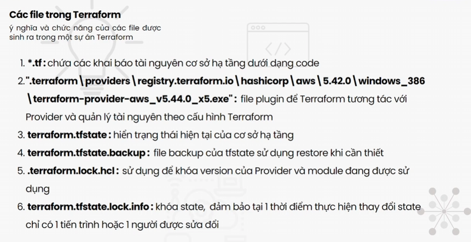

# Terraform

Terraform là gì?
+ Thông dụng ở thời điểm hiện tại
+ Open-source của HashiCorp
+ Chuyên dùng provisioning

## Lợi ích của Terraform so với công cụ khác:
    + opensource miễn phí
    + decalrative programing: diễn tả những thứ bạn cần và Terraform làm cho bạn.
    + Có thể cung cấp hạ tầng cho nhiều cloud khác nhau như AWS, GCP, AZURE

## Tính năng chính

- **Hạ tầng như mã (Infrastructure as Code)**: 
    + là phương pháp quản lý và cung cấp cơ sở hạ tầng thông qua code
    + thay vì cấu hình CSHT thủ công, laC sử dụng các tệp định nghĩa có thể được máy đọc, ví dụ: JSON, YAML hoặc HCL,...
    + khi các tệp này được thực thi => tự động tạo ra và cấu hình hạ tầng
    

- **Nhà cung cấp đa dạng**: Hỗ trợ nhiều nhà cung cấp dịch vụ đám mây và các dịch vụ khác nhau.

- **Quản lý trạng thái**: Terraform lưu trữ trạng thái của cơ sở hạ tầng để theo dõi các thay đổi và đảm bảo tính nhất quán.

- **Kế hoạch trước khi thực hiện**: Terraform cung cấp khả năng xem trước các thay đổi sẽ được thực hiện trước khi áp dụng chúng.

## Kết luận

Terraform là một công cụ mạnh mẽ giúp quản lý cơ sở hạ tầng một cách hiệu quả và an toàn. Bằng cách sử dụng Terraform, bạn có thể dễ dàng định nghĩa, triển khai và quản lý cơ sở hạ tầng của mình trên nhiều nhà cung cấp dịch vụ đám mây khác nhau.